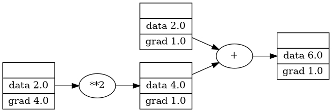

$$ # miniautograd $$
miniautograd is a small auto-grad engine built from scratch using numpy.

## Motivation ## 
1. Learning backpropagation
2. Understanding working of Neural Network
3. Inspired Andrej Karpathy micrograd

## Features ## 
1. Computation graph with primitive operations like ( +, -, *, exp, /, etc)
2. Supports broadcasting
3. Basic Neural Network
4. Loss functions (MSE, BCE, CCE for now)

## Quick Exmaple ## 

## Limitations ##
1. No GPU support
2. supports only few activation function
3. Not optimized 
3. Educational purpose

## Future Work ##
1. Add Convoution layer
2. Imporve performance
3. Add Optimizers
